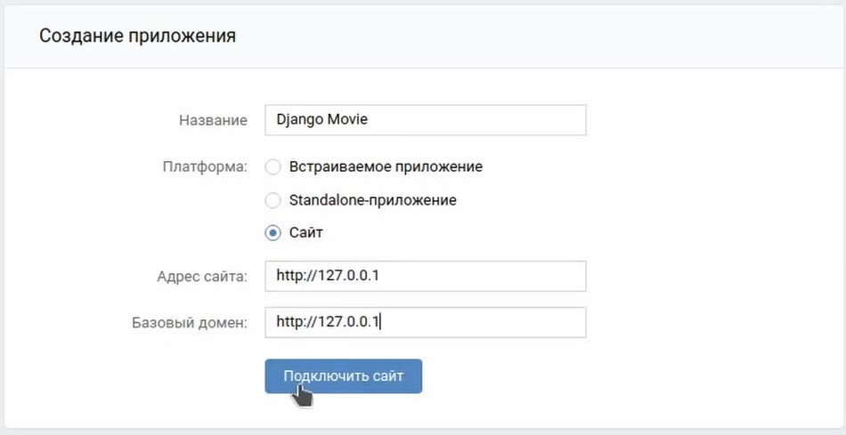
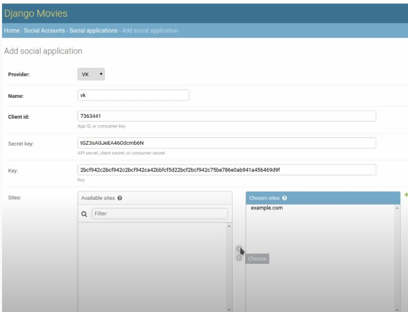
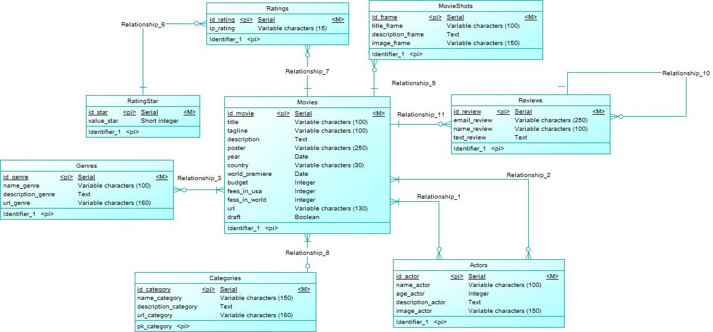

# Фильмы Django 3

***

## Описание

Кинобиблиотека на Django 3.

Приложение докерезировано.

На сайте реализован следующий функционал:
* Пагинация
* recapcha3 (настройка в разделе _дополнительные возможности_)
* Подписка на рассылку (настройка в разделе _дополнительные возможности_)
* Мультиязычный сайт (ru/en)
* Авторизация и регистрация
* Вход на сайт через VK (настройка в разделе _дополнительные возможности_)

---

## Окружение проекта:
  * Python 3.8
  * Django 3
  * Celery
  * Redis
  * SQLite

---

## Запуск

Склонируйте репозиторий с помощью git

    https://github.com/ChebuRashkaRF/Django_movie.git

Перейти в папку:
```bash
cd django_movie
```

В терминале необходимо прописать следующую команду для сбора нового образа и запуска контейнеров:

```bash
docker-compose up --build
```

База данных заполнена тестовыми данными.

Доступен _супер пользователь_:
* Логин: admin111
* Пароль: 1234

---

## Дополнительные возможности

Для того чтобы на сайте работал весь функционал, необходимо выполнить следующие действия.

1. Чтобы работала recapcha3, нужно ее создать, например, [google recapcha](https://developers.google.com/recaptcha/docs/v3). И в файле _.env.dev_ указать значения переменным: RECAPTCHA_PUBLIC_KEY, RECAPTCHA_PRIVATE_KEY

2. Чтобы работала рассылка, необходимо настроить бесплатный SMTP Сервер от Google, для этого нужно выполнить **Шаг 1** в [инструкции](https://www.hostinger.com.ua/rukovodstva/kak-ispolzovat-smtp-server "бесплатный SMTP Сервер от Google "), а затем в файле _.env.dev_ указать значения переменным: EMAIL_HOST, EMAIL_HOST_USER, EMAIL_HOST_PASSWORD.

3. Чтобы работал вход на сайт через VK, необходимо создать приложение на сайте _https://vk.com/dev_. Прописать настройки как на изображении:  Далее зайти на сайт администратора (http://127.0.0.1/admin) и в _Social applications_ нужно добавить запись как на изображении:


---

## База данных


